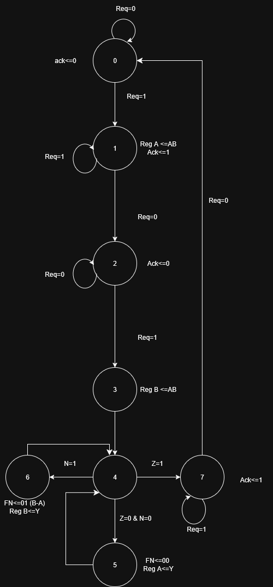
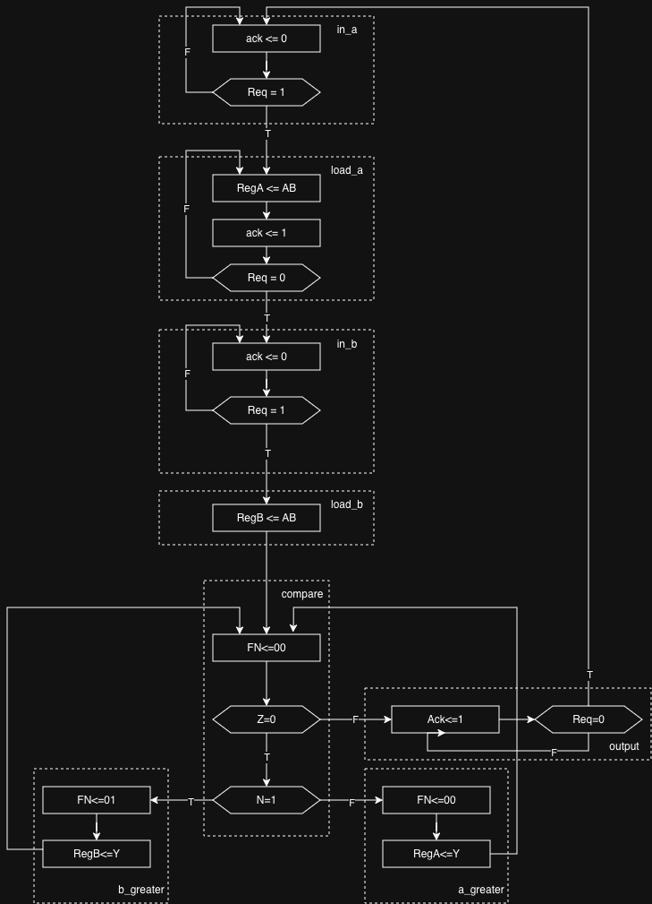

# Design of Digital Systems - Assignment 1

## Whiteboard for registering thoughts and answers

### Whiteboard

### Answers

#### Task 0

##### 0.b)

A register of 16 bits is made up of 16 Flip Flops, thus since we are using 2, 16 bit registers, we expect to use 32 Flip Flops. In terms of LUTs for the 16-bit multiplexer we need approximately 16 LUTs, for the ALU result we also need approximately 16 LUTs, since the result of bit i is a function of f(A_i,B_i,borrow_i,FN_1,FN_0) which fits in one LUT but the subtraction also needs to calculate the borrow/carry passed to the next bit, which is a function of f(A_i,B_i,borrow_i,FN_1,FN_0), that's another LUT. Since we need the borrow/carry chain calculated up to the last bit, we add 16 bits for output and 15 bits for the borrow/carry chain, which adds up to around 31 LUTs for the ALU. Then for the Z flag, which needs to reduce all the 16 bits into one bit, indicating if they are all 0 or not, needs around 3 LUTs since $16/6\approx3$. Our guess for LUTs is, thus, around 50.

Great breakdown on task 0 b), I totally agree with your logic. Just a minor detail I was thinking about for the Z flag, since we need to reduce 16 bits to 1, grouping 16/6 gives us 3 LUTs for the first layer, but I think we'd actually need a 4th LUT to combine the outputs of those first 3 LUTs into the final single bit. It doesn't change the overall estimate much, but thought it was worth mentioning.

#### Task 2

##### 2.b)

Our proposed drawing for the FSMD

Your initial drawing was a great foundation and the logic flow was spot on. I just made a slightly updated version to make it 100% hardware-accurate based on the physical datapath we have in Figure 2.
The main adjustments are:
1. **State 2 & 3 (Loading RegB):** Separated the waiting state (`Req=0`) from the loading state. This ensures we don't save switch bounce or garbage data into `RegB` while the user is still flipping the switches.
2. **The "Comparator" (States 4, 5, 6):** Since we only have one ALU and no dedicated comparator, the FSM can't directly check `RegA > RegB`. Instead, we have to command the ALU to subtract (`FN=00`) and then look at the physical output flags (`Z` and `N`) to decide our next state. 
*(Note: I also removed `C <= RegA` from the final state because in Fig 2, C is permanently buffered to RegA, so the FSM doesn't need a control signal for it).*

Here is the revised diagram:

Our final FSM diagram:

We also drew up a ASM:

