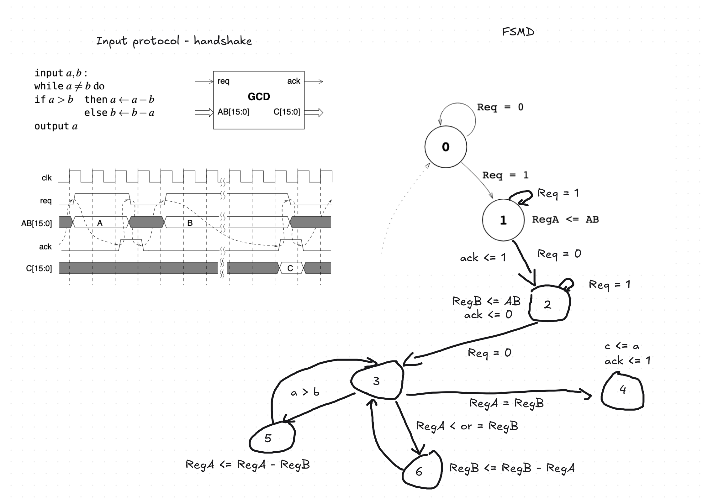

# Design of Digital Systems - Assignment 1

## Whiteboard for registering thoughts and answers

### Whiteboard

### Answers

#### Task 0

##### 0.b)

A register of 16 bits is made up of 16 Flip Flops, thus since we are using 2, 16 bit registers, we expect to use 32 Flip Flops. In terms of LUTs for the 16-bit multiplexer we need approximately 16 LUTs, for the ALU result we also need approximately 16 LUTs, since the result of bit i is a function of f(A_i,B_i,borrow_i,FN_1,FN_0) which fits in one LUT but the subtraction also needs to calculate the borrow/carry passed to the next bit, which is a function of f(A_i,B_i,borrow_i,FN_1,FN_0), that's another LUT. Since we need the borrow/carry chain calculated up to the last bit, we add 16 bits for output and 15 bits for the borrow/carry chain, which adds up to around 31 LUTs for the ALU. Then for the Z flag, which needs to reduce all the 16 bits into one bit, indicating if they are all 0 or not, needs around 3 LUTs since $16/6\approx3$. Our guess for LUTs is, thus, around 50.

#### Task 2

##### 2.b)

Our proposed drawing for the FSMD

